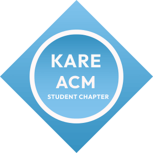

<div align="center">

  

  # 🚀 DISFRUTAR 2K26 — DISFRUTAR-OS v2.26
  ### *Cinematic AI OS Boot Experience & National 32-Hour AI Hackathon Portal*

  **Hosted by KARE ACM Student Chapter**  
  *Kalasalingam Academy of Research and Education (Deemed to be University)*

  ---

  [](https://react.dev/)
  [](https://vitejs.dev/)
  [](https://www.typescriptlang.org/)
  [](https://tailwindcss.com/)
  [](https://firebase.google.com/)
  [](https://greensock.com/gsap/)
  [](https://kare.acm.org/)

  <p align="center">
    <a href="#-about-disfrutar-2k26">About Hackathon</a> •
    <a href="#-cinematic-kernel-boot-experience">Boot Experience</a> •
    <a href="#-key-features">Key Features</a> •
    <a href="#-tech-stack--architecture">Tech Stack</a> •
    <a href="#-project-structure">Project Structure</a> •
    <a href="#-design-system">Design System</a> •
    <a href="#-getting-started">Getting Started</a> •
    <a href="#-kare-acm-student-chapter">KARE ACM</a>
  </p>

</div>

---

## 📖 Table of Contents

- [Overview & Detailed Explanation](#-about-disfrutar-2k26)
- [DISFRUTAR 2K26 Cinematic Kernel Boot Experience](#-cinematic-kernel-boot-experience)
- [Key Features](#-key-features)
  - [1. Telemetry Preloader HUD & Diagnostics](#1-telemetry-preloader-hud--diagnostics)
  - [2. GPU-Accelerated 2,500+ Particle Vector Engine](#2-gpu-accelerated-2500-particle-vector-engine)
  - [3. Interactive Multi-Step Team Registration](#3-interactive-multi-step-team-registration)
  - [4. Real-Time Admin Telemetry & Participant Management](#4-real-time-admin-telemetry--participant-management)
  - [5. Serverless AI Integration (Google Gemini 2.5/3.0)](#5-serverless-ai-integration-google-gemini-2530)
- [Tech Stack & Architecture](#-tech-stack--architecture)
- [Project Structure](#-project-structure)
- [Design System Specifications](#-design-system)
- [Getting Started & Local Setup](#-getting-started)
- [Environment Variables Setup](#-environment-variables)
- [Firebase Security Rules](#-firebase-security-rules)
- [KARE ACM Student Chapter](#-kare-acm-student-chapter)
- [License & Acknowledgments](#-license--acknowledgments)

---

## 🌟 About DISFRUTAR 2K26

### Detailed Event Overview
**DISFRUTAR 2K26** is a prestigious **National 32-Hour AI Hackathon** organized and hosted by the **KARE ACM Student Chapter** at **Kalasalingam Academy of Research and Education (KARE)**. 

Bringing together top student developers, AI researchers, software engineers, and creative problem solvers from across the country, DISFRUTAR 2K26 challenges participants to design, build, and deploy high-impact, real-world artificial intelligence solutions within an intense 32-hour hackathon environment.

> [!IMPORTANT]
> **Event Core Highlights:**
> - **Duration**: 32 Hours Non-Stop Innovation (15 August 2026).
> - **Host Institution**: Kalasalingam Academy of Research and Education (Deemed to be University), Anand Nagar, Krishnankoil.
> - **Organizing Body**: KARE ACM Student Chapter.
> - **Team Size**: 3 to 4 Members per Team.
> - **Core Problem Domains**: Generative AI, Autonomous Agents, Edge AI & IoT, Computer Vision, NLP & Large Language Models, and Quantum Machine Learning.

### Mission & Vision
- **Accelerate Practical AI Development**: Empower students to convert theoretical AI research into functional prototype applications that solve domain-specific real-world challenges.
- **Set New Benchmarks for Event Web Design**: Establish an immersive digital gateway using OLED space canvas styling, cinematic motion choreography, and hardware telemetry micro-interactions.

---

## 🌌 DISFRUTAR 2K26 Cinematic Kernel Boot Experience

The centerpiece of the portal is **DISFRUTAR-OS v2.26**, an interactive **AI OS Kernel Boot Experience** designed to evoke the sensation of initializing a high-performance sci-fi computing engine.

```
+-------------------------------------------------------------------------+
|                  DISFRUTAR-OS v2.26 KERNEL INITIALIZATION               |
|                                                                         |
|  [PHASE 1: t=0.0s - 1.8s]  Telemetry HUD Preloader & Hardware Checks   |
|  [PHASE 2: t=1.8s - 3.7s]  2,500 Particle Vector Matrix Assembly       |
|  [PHASE 3: t=3.7s - 5.5s]  HD ACM Emblem Materialization & Glow       |
|  [PHASE 4: t=5.5s - 6.6s]  Hero Title Staggered Blur Reveal            |
|  [PHASE 5: t=6.6s - 8.0s]  32-Hour Subtitle Pill Badge Arrival         |
|  [PHASE 6: t=8.0s+]        Peripheral Starfield Dispersal & UI Mount |
+-------------------------------------------------------------------------+
```

### Key Technical Pillars of the Boot Experience:

1. **Hardware Diagnostic Telemetry HUD (`PreloaderHUD.tsx`)**:
   - Displays real-time terminal diagnostic telemetry, memory address sweeps (`0x7F8B2C`), concentric radar sweep rings, and dynamic percentage counters (`0% ➔ 100%`).
   - Includes real-time acoustic telemetry toggle (sci-fi boot audio feedback & mute controller).

2. **2,500 Vector Particle Engine (`CanvasParticleSystem.tsx`)**:
   - Runs on a custom HTML5 Canvas 2D engine locked at 60 FPS.
   - **Physics Equations**: Implements spring-damping restoration forces (`F = -k · Δx`), velocity dampening (`0.92`), and magnetic cursor deflection fields.
   - **Phase Transition**: At `t = 3.7s`, the central particle cloud radially explodes into a peripheral ambient starfield (`r = 160px – 340px`), completely clearing the viewport center to preserve 100% text legibility.

3. **Mathematical Motion Choreography (`HeroRevealSequence.tsx`)**:
   - Motion paths driven by GSAP 3.15 and Motion 12 using custom cubic Bézier easing curves (`cubic-bezier(0.16, 1, 0.3, 1)`).
   - 3D character blur reveals and smooth scale elevation (`scale: 0.85 ➔ 1.0`).

---

## ✨ Key Features

### 1. Telemetry Preloader HUD & Diagnostics
- Engineering terminal display simulating OS boot, memory allocation, and kernel readiness checks.
- Zero-lag progression sequence with non-blocking async state transitions.

### 2. GPU-Accelerated 2,500+ Particle Vector Engine
- High-density particle matrix rendering on HTML5 2D Canvas.
- Multi-phase particle lifecycle: `Grid Matrix` ➔ `Orbital Swarm` ➔ `Vector Emblem Assembly` ➔ `Peripheral Starfield Clear`.

### 3. Interactive Multi-Step Team Registration
- Streamlined 4-step registration pipeline (`RegistrationFlow.tsx`):
  - **Step 1**: Team Info & Track Selection.
  - **Step 2**: Leader Details & Contact Verification.
  - **Step 3**: Member Roster Setup (4–5 members).
  - **Step 4**: UPI QR Payment (`acmkare@upi`) & Payment Screenshot Upload.

### 4. Real-Time Admin Telemetry & Participant Management
- Protected Admin Portal (`/admin`) restricted to authorized ACM coordinators (`99240041356@klu.ac.in`).
- Real-time Firestore sync with search, filtering, registration verification, and CSV/JSON data export.

### 5. Serverless AI Integration (Google Gemini 2.5/3.0)
- Express server backend leveraging `@google/genai` to handle automated participant FAQs, rule explanations, and track guidance.

---

## 🛠️ Tech Stack & Architecture

| Layer | Technologies Used |
| :--- | :--- |
| **Frontend Framework** | [React 19](https://react.dev/), [Vite 6.2](https://vitejs.dev/), [TypeScript 5.8](https://www.typescriptlang.org/) |
| **Styling & Icons** | [Tailwind CSS v4](https://tailwindcss.com/), Lucide React Icons, Radix UI Slot |
| **Animation Systems** | [GSAP 3.15](https://greensock.com/gsap/), [Motion 12](https://motion.dev/), HTML5 Canvas 2D Engine |
| **Cloud & Database** | [Firebase Authentication](https://firebase.google.com/docs/auth), [Cloud Firestore](https://firebase.google.com/docs/firestore), [Firebase Storage](https://firebase.google.com/docs/storage) |
| **Backend & AI** | Node.js, Express 4.21, [@google/genai 2.4](https://www.npmjs.com/package/@google/genai) |
| **Build & Tooling** | Bun / npm, Vite HMR Plugin |

---

## 📂 Project Structure

```bash
DSFRUTAR-2K26/
├── public/
│   ├── acm_logo.png            # Official KARE ACM Student Chapter Logo
│   ├── hero_secction_bg.png    # Cinematic OLED Background Wallpaper
│   └── images/                 # Event UI Graphic Assets
├── src/
│   ├── components/
│   │   ├── admin/
│   │   │   ├── AdminAnalytics.tsx   # Analytics Metrics & Distribution Charts
│   │   │   ├── AdminDashboard.tsx   # Live Participant Telemetry Table
│   │   │   └── AdminLogin.tsx       # Secured Admin Authentication Portal
│   │   ├── registration/
│   │   │   ├── PaymentStep.tsx      # Instant UPI QR Payment & Receipt Upload
│   │   │   ├── RegistrationFlow.tsx # Multi-Step Registration Controller
│   │   │   └── TeamStep.tsx         # Roster & Member Form Controllers
│   │   ├── ui/
│   │   │   ├── banner.tsx           # Live Status Announcement Header
│   │   │   └── footer-section.tsx   # Comprehensive Footer & Links
│   │   ├── AboutSection.tsx         # Track Details, Rules & Event Timeline
│   │   ├── BootExperience.tsx       # DISFRUTAR-OS Kernel Boot Controller
│   │   ├── CanvasParticleSystem.tsx # 2500 Particle Physics Vector Canvas
│   │   ├── FaqSection.tsx           # Interactive FAQ with Instant Search
│   │   ├── HeroRevealSequence.tsx   # 8-Second Cinematic Motion Choreography
│   │   ├── HeroSection.tsx          # Main Viewport Banner & CTA Buttons
│   │   ├── LoginScreen.tsx          # Dual-Auth Participant Access Portal
│   │   ├── Navbar.tsx               # Fixed Glassmorphic Navigation Bar
│   │   └── PreloaderHUD.tsx         # Hardware Telemetry Diagnostic Terminal
│   ├── lib/
│   │   └── firebase.ts              # Firebase Client SDK Initializer
│   ├── types/
│   │   └── index.ts                 # Data Schemas & TypeScript Definitions
│   ├── utils/
│   │   └── particlePhysics.ts       # Vector Math & Spring-Damping Utilities
│   ├── App.tsx                      # Root Application View Router
│   ├── index.css                    # Design Tokens & Master Utilities
│   └── main.tsx                     # DOM Entrypoint & Mounting Script
├── .env.example                     # Environment Variables Template
├── cors.json                        # Firebase Storage CORS Settings
├── DESIGN.md                        # Complete Design System Specification
├── firestore.rules                  # Firestore Database Security Rules
├── package.json                     # Node Dependencies & Build Scripts
├── storage.rules                    # Firebase Storage Security Rules
├── tsconfig.json                    # TypeScript Configuration
└── vite.config.ts                   # Vite 6 & Tailwind CSS v4 Configuration
```

---

## 🎨 Design System

DISFRUTAR 2K26 is built on an **OLED Space & Telemetry HUD Design System** defined in `DESIGN.md`.

### Core Brand Tokens

| Token Name | Color Value | Applied Context |
| :--- | :--- | :--- |
| **Canvas Background** | `#06080B` / `rgb(6, 8, 11)` | Dark Viewport Container |
| **KARE ACM Sky Blue** | `#50A7D8` / `rgb(80, 167, 216)` | Primary Brand, Progress Ring, Glowing Borders |
| **Electric Sky Cyan** | `#70C5F5` / `rgb(112, 197, 245)` | Gradient Text Highlights, Header Accents |
| **Pure White** | `#FFFFFF` / `rgb(255, 255, 255)` | Main Headers, Circle Glows, High Contrast Text |
| **Soft Blue Dust** | `#E0F2FE` / `rgb(224, 242, 254)` | Particle Ambient Dust & Subtext Details |

---

## 🚀 Getting Started

Follow these instructions to run DISFRUTAR 2K26 on your local machine:

### 1. Clone the Repository
```bash
git clone https://github.com/Venkatasai6789/DSFRUTAR-2K26.git
cd DSFRUTAR-2K26
```

### 2. Install Dependencies
```bash
npm install
# or
bun install
```

### 3. Configure Environment Variables
Copy `.env.example` to create a `.env` file:
```bash
cp .env.example .env
```

Add your Firebase and Gemini credentials to `.env`.

### 4. Run Development Server
```bash
npm run dev
```
Open `http://localhost:3000` in your web browser.

### 5. Production Build
```bash
npm run build
```

---

## 🔑 Environment Variables Setup

```env
# Google Gemini API Key
GEMINI_API_KEY="YOUR_GEMINI_API_KEY"

# Application Hosted URL
APP_URL="http://localhost:3000"

# Firebase Client Web SDK Config
VITE_FIREBASE_API_KEY="YOUR_FIREBASE_API_KEY"
VITE_FIREBASE_AUTH_DOMAIN="YOUR_PROJECT.firebaseapp.com"
VITE_FIREBASE_PROJECT_ID="YOUR_PROJECT_ID"
VITE_FIREBASE_STORAGE_BUCKET="YOUR_PROJECT.firebasestorage.app"
VITE_FIREBASE_MESSAGING_SENDER_ID="YOUR_MESSAGING_SENDER_ID"
VITE_FIREBASE_APP_ID="YOUR_APP_ID"
VITE_FIREBASE_MEASUREMENT_ID="YOUR_MEASUREMENT_ID"
```

---

## 🔒 Firebase Security Rules

### Firestore Security Rules (`firestore.rules`)
```javascript
rules_version = '2';
service cloud.firestore {
  match /databases/{database}/documents {
    match /registrations/{document} {
      allow read, create, update: if true;
    }
    match /{document=**} {
      allow read, write: if request.auth != null;
    }
  }
}
```

### Firebase Storage Security Rules (`storage.rules`)
```javascript
rules_version = '2';
service firebase.storage {
  match /b/{bucket}/o {
    match /{allPaths=**} {
      allow read, write: if true;
    }
  }
}
```

---

## 🏛️ KARE ACM Student Chapter

<div align="center">
  
  <br />
  <b>Kalasalingam Academy of Research and Education ACM Student Chapter</b>
  <br />
  <i>Advancing Computing as a Science & Profession</i>
</div>

\
The **KARE ACM Student Chapter** is dedicated to empowering students through technical innovation, coding competitions, open-source workshops, and national hackathons.

### Connect With Us:
- 🌐 **Official Website**: [kare.acm.org](https://kare.acm.org/)
- 📧 **Contact Email**: [kareacm@klu.ac.in](mailto:kareacm@klu.ac.in)
- 💼 **LinkedIn Page**: [KARE ACM Student Chapter](https://www.linkedin.com/company/acmkare/)
- 📸 **Instagram Handle**: [@acm_kare](https://www.instagram.com/acm_kare)

---

## 📜 License & Acknowledgments

Distributed under the **MIT License**. See `LICENSE` for more details.

**Organized & Supported By:**
- **Kalasalingam Academy of Research and Education (KARE)**
- **ACM (Association for Computing Machinery) Student Chapter**
- **DISFRUTAR 2K26 Organizing Committee & Mentors**

---

<div align="center">
  <sub>Crafted with ❤️ by KARE ACM Student Chapter</sub>
</div>
